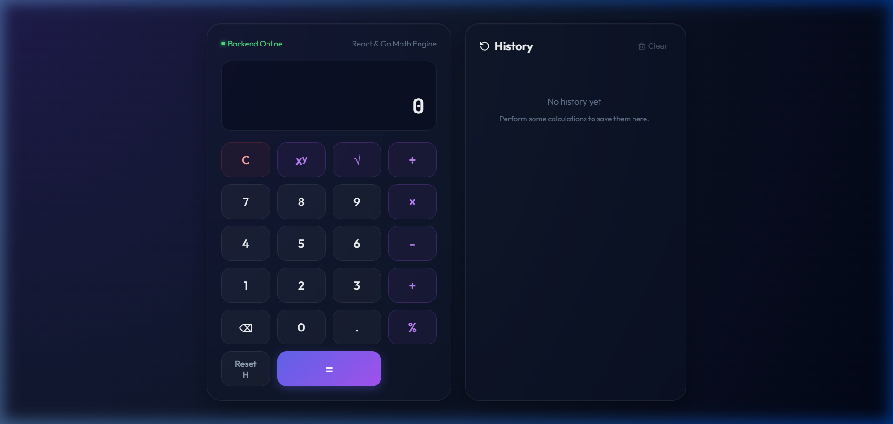
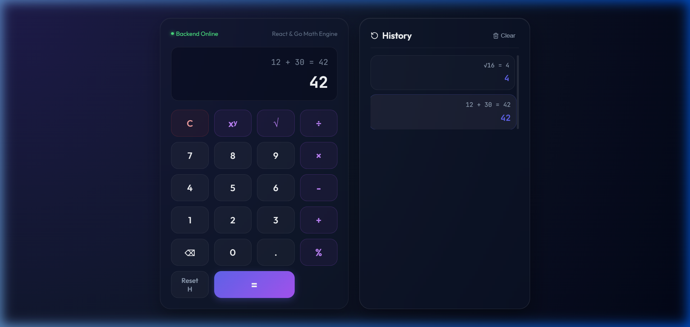

# Full-Stack Calculator Application

This is a premium, full-stack calculator application featuring a modern **React (TypeScript)** frontend styled with custom glassmorphism Vanilla CSS, and a fast, lightweight **Go (Golang)** backend microservice.

The frontend communicates with the backend REST API to perform both basic arithmetic operations (addition, subtraction, multiplication, division) and advanced calculations (exponentiation, square root, percentage), featuring input history, error handling, responsive mobile support, and full keyboard interaction support.

---

## 🎨 Visual Preview & Demo

Here is a quick overview of the premium user interface in action, executing calculations, keyboard inputs, and calculation logs:

### Interactive Video Walkthrough


### UI Showcase
| Sleek Initial Interface | History Restoration State |
|:---:|:---:|
|  |  |

---

## Technical Stack
- **Frontend**: React 19, TypeScript, Vite, Vanilla CSS, Lucide React, Vitest + React Testing Library (for unit tests).
- **Backend**: Go 1.22+, Standard Library routing (`net/http`), native Go testing package (for unit tests).
- **Orchestration**: Docker, Docker Compose.

---

## Directory Structure
```
├── assets/                   # Screenshots and demo media for README
├── backend/                  # Go Microservice Source
│   ├── cmd/server/main.go    # Entrypoint (router & port config)
│   ├── pkg/calculator/       # Math logic package (unit tested)
│   ├── pkg/handlers/         # HTTP Handlers, Logging & CORS (unit tested)
│   ├── Dockerfile            # Multi-stage Docker config for Go
│   └── go.mod                # Go module descriptor
│
├── frontend/                 # React SPA Source
│   ├── src/components/       # UI Components (Calculator.tsx)
│   ├── src/services/api.ts   # API fetch integration layer
│   ├── src/index.css         # Styling system (Glassmorphism & animations)
│   ├── src/test/             # Vitest configuration files
│   ├── vite.config.ts        # Vite and Vitest configs
│   ├── Dockerfile            # Frontend containerization
│   └── nginx.conf            # Nginx server configurations for production assets
│
├── specs/                    # Specification documents (API, design, layout)
├── docker-compose.yml        # Orchestration configuration
├── run.bat                   # Quick start Windows batch script
└── README.md                 # Project user manual (This file)
```

---

## How to Setup and Run Locally

### Prerequisites
- **Go** (version 1.22 or higher)
- **NodeJS** (version 18 or higher) and **npm**

---

### ⚡ Quick Start (Windows Script)
To start both the Go backend and React frontend with a single command:
1. Double-click the [run.bat](file:///c:/Users/mmval/OneDrive/Desktop/Dev/Projects/Sezzle/run.bat) file in the project root directory (or execute `./run.bat` in your terminal).
2. Open your browser and go to: **[http://localhost:5173/](http://localhost:5173/)**

---

### Running the Backend

1. Navigate to the backend directory:
   ```bash
   cd backend
   ```

2. Start the server (runs on `http://localhost:8080` by default):
   ```bash
   go run ./cmd/server
   ```
   *You can override the port by defining the `PORT` environment variable (e.g. `PORT=9000 go run ./cmd/server` or `$env:PORT=9000; go run ./cmd/server` in Windows).*

3. Run the unit test suite:
   ```bash
   go test -v ./...
   ```

4. View test coverage report:
   ```bash
   go test -coverprofile=coverage.out ./...
   go tool cover -html=coverage.out
   ```

---

### Running the Frontend

1. Navigate to the frontend directory:
   ```bash
   cd frontend
   ```

2. Install dependencies:
   ```bash
   npm install
   ```

3. Spin up the Vite development server (runs on `http://localhost:5173`):
   ```bash
   npm run dev
   ```

4. Run the frontend unit tests:
   ```bash
   npm run test
   ```

5. Build for production (outputs static bundle to `/dist`):
   ```bash
   npm run build
   ```

---

### Running via Docker Compose (Single Command Setup)

If you have **Docker** and **Docker Compose** installed, you can spin up the entire full-stack application automatically:

1. In the project root directory, run:
   ```bash
   docker compose up --build
   ```

2. Once booted:
   - **Frontend** is served on `http://localhost:3000`
   - **Backend** is accessible on `http://localhost:8080`

---

## REST API Specification & Examples

The backend REST API is hosted on port `8080`.

### 1. Health Check Endpoint
Used to confirm the backend microservice is online.
* **URL**: `http://localhost:8080/health`
* **Method**: `GET`
* **Response Example (200 OK)**:
  ```json
  {
    "status": "healthy"
  }
  ```
* **curl Command**:
  ```bash
  curl http://localhost:8080/health
  ```

### 2. Calculation Endpoint
Performs mathematical calculations based on the operator and operands.
* **URL**: `http://localhost:8080/api/calculate`
* **Method**: `POST`
* **Headers**: `Content-Type: application/json`

#### Example A: Addition (Binary Operation)
* **Request**:
  ```json
  {
    "operator": "add",
    "operand1": 12.5,
    "operand2": 3.5
  }
  ```
* **Response (200 OK)**:
  ```json
  {
    "result": 16,
    "expression": "12.5 + 3.5 = 16"
  }
  ```
* **curl Command**:
  ```bash
  curl -X POST http://localhost:8080/api/calculate \
    -H "Content-Type: application/json" \
    -d '{"operator":"add","operand1":12.5,"operand2":3.5}'
  ```

#### Example B: Square Root (Unary Operation)
* **Request**:
  ```json
  {
    "operator": "sqrt",
    "operand1": 16
  }
  ```
* **Response (200 OK)**:
  ```json
  {
    "result": 4,
    "expression": "√16 = 4"
  }
  ```
* **curl Command**:
  ```bash
  curl -X POST http://localhost:8080/api/calculate \
    -H "Content-Type: application/json" \
    -d '{"operator":"sqrt","operand1":16}'
  ```

#### Example C: Percentage (Two-Operand Operation)
* **Request**:
  ```json
  {
    "operator": "percentage",
    "operand1": 20,
    "operand2": 500
  }
  ```
* **Response (200 OK)**:
  ```json
  {
    "result": 100,
    "expression": "20% of 500 = 100"
  }
  ```

#### Example D: Invalid Operation (Error State)
* **Request (Division by Zero)**:
  ```json
  {
    "operator": "divide",
    "operand1": 5,
    "operand2": 0
  }
  ```
* **Response (400 Bad Request)**:
  ```json
  {
    "error": "Invalid input: cannot divide by zero"
  }
  ```

---

## Design Rationale and Assumptions

1. **Zero-Dependency Backend Routing**:
   We used the Go standard library's enhanced pattern matching router introduced in Go 1.22 (`POST /api/calculate` pathing). This eliminates the need for external routing frameworks (like Gin or Chi), reducing package bloat and maintaining maximum performance and safety.

2. **CORS Handling**:
   A CORS middleware is implemented on the backend to allow incoming requests from any frontend port (e.g. localhost:5173 or localhost:3000), supporting direct frontend-to-backend fetch interactions securely.

3. **Percentage Operator Behavior**:
   We implemented two distinct percentage pathways:
   - **Unary Percentage**: Typing `15` and clicking `%` divides the number by 100 (`15% = 0.15`).
   - **Binary Percentage**: Typing `500` then `+` then `10` and clicking `%` computes `10% of 500` (`50`), putting `50` as the current operand to proceed with the calculation (`500 + 50 = 550`).

4. **Keyboard Interactivity**:
   The frontend listens to window key events, mapping numbers (`0-9`), dot (`.`), basic operators (`+`, `-`, `*`, `/`, `^`, `%`), evaluation (`Enter`, `=`), delete (`Backspace`), and clear (`Escape`) directly to matching inputs.

5. **Historical Logging**:
   Calculations are logged locally in the client browser's `localStorage` (persisting up to 20 calculations). Users can view this sidebar panel, click any past calculation to restore it back to the active display screen, or clear it.

---

## Prompts Used

This application was developed using **Antigravity (Gemini 3.5 Flash)** with the following command sequence:

1. **Specs Creation Prompt**:
   > *"create a specs/ directory and allocate all spec.md files based on the instructions I've received"*
2. **Implementation Plan Approval Prompt**:
   > *Approved the drafted implementation_plan.md artifact detailing Go package structure, Vite project setup, and test verification models.*
3. **Execution Workflows**:
   > *Sequential directives to implement and write files (go.mod, main.go, handlers.go, calculator.go, index.css, App.tsx, Calculator.tsx, api.ts, test configurations), run commands to build/run unit tests on both ends, configure Docker files, and compose the root orchestration script.*
